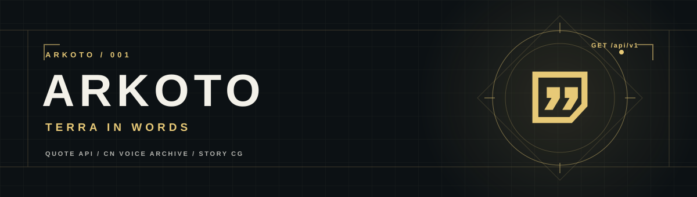

<div align="center">

**让一句来自泰拉的台词，出现在你的网站、机器人或桌面。**

《明日方舟》干员台词、对应立绘与剧情 CG 的非官方 API 原型。

[快速开始](#快速开始) · [接口一览](#接口一览) · [Cloudflare 部署](#cloudflare-部署) · [数据与使用说明](#数据与使用说明)

</div>

> [!NOTE]
> Arkoto 是玩家项目，与《明日方舟》及其运营方无关。游戏文字和图片的权利归原权利人；公开可访问的社区镜像不等于使用授权。

## 现在能做什么

| 功能 | 说明 |
| --- | --- |
| 随机台词 | 从国服干员语音文本中随机返回一条，可按干员和场景筛选 |
| 今日台词 | 按北京时间固定，同一天、同一筛选条件返回同一条 |
| 对应立绘 | 台词响应附带该干员的立绘 URL、文件名和来源 |
| 剧情 CG | 独立的随机图片接口；网页打开前有剧透提示 |
| 接入友好 | JSON 响应、跨域 GET、无需密钥的本地预览 |

当前数据快照：**18,237** 条台词 · **435** 个有台词的干员 ID · **829** 张剧情 CG 文件索引。台词数据库约 **5 MB**；仓库只保存代码与轻量元数据索引，不打包游戏台词数据库或图片文件。

## 快速开始

需要 Python 3.12+。本地预览无需安装 Python 第三方依赖：

```bash
git clone https://github.com/ethan527w/arkoto.git
cd arkoto
python3 -m scripts.import_data --download
python3 server.py
```

打开 **http://127.0.0.1:8765/**。首次导入下载约 34 MB 的国服游戏数据，并在 `data/generated/` 生成 SQLite 数据库。已有原始 JSON 时可省略 `--download`。重新导入后需要重启本地服务器。

## 接口一览

| 方法与路径 | 返回内容 |
| --- | --- |
| `GET /api/v1/quotes/random` | 随机台词与干员立绘 |
| `GET /api/v1/quotes/today` | 北京时间当日固定台词与立绘 |
| `GET /api/v1/operators?q=阿米娅&limit=20` | 搜索干员；`limit` 最大 200 |
| `GET /api/v1/categories` | 台词场景及数量 |
| `GET /api/v1/cg/random` | 随机剧情 CG 的图片链接与来源 |
| `GET /api/v1/status` | 数据量、来源和同步时间 |
| `GET /api/v1/wallpapers/random` | 预留；无已授权壁纸库时返回 503 |

台词接口支持 `operator`（干员名称或 ID）与 `title`（台词场景）参数。中文参数需要按标准 URL 编码：

```bash
curl 'http://127.0.0.1:8765/api/v1/quotes/random?operator=%E9%98%BF%E7%B1%B3%E5%A8%85'
```

响应示意：

```json
{
  "content": "一段来自泰拉的声音……",
  "operator": { "id": "char_002_amiya", "name": "阿米娅" },
  "title": "任命助理",
  "illustration": {
    "url": "https://raw.githubusercontent.com/…/char_002_amiya_2.png",
    "source": "https://github.com/ArknightsAssets/ArknightsAssets2/…"
  },
  "edition": "CN"
}
```

实际响应还包含 `id`、`date` 和台词数据 `source`。没有匹配结果时返回 404；缺立绘时 `illustration` 为 `null`。**剧情 CG 与干员语音没有可靠的一一对应关系**，所以 CG 是独立图库，不会伪装成某条语音的配图。

## Cloudflare 部署

项目已准备 **Workers + 静态资源 + D1** 版本，无需另外租 VPS。Workers 托管网页和 API，D1 存台词；图片仍由来源镜像按需加载。完整步骤见 [Cloudflare 部署指南](docs/cloudflare.md)。

本地模拟 Cloudflare 环境：

```bash
npm ci
python3 -m scripts.export_d1
npx wrangler d1 execute arkoto --local --file=data/generated/arkoto-d1.sql --yes
npm run dev
```

然后打开 **http://127.0.0.1:8787/**。首次运行前仍需按“快速开始”导入原始数据。`wrangler.jsonc` 中的 D1 ID 目前是本地开发占位值；远程部署前必须换成自己 Cloudflare 账户创建的数据库 ID。

## 数据与使用说明

- 台词和干员名：[ArknightsGamedata](https://github.com/ArknightsAssets/ArknightsGamedata) 的国服数据快照，导入自 `charword_table.json` 和 `character_table.json`。
- 干员立绘文件名：[ArknightsAssets2](https://github.com/ArknightsAssets/ArknightsAssets2/tree/cn/assets/dyn/arts/charportraits)。当前 435 个有台词的干员 ID 均能找到立绘。
- 剧情 CG 文件名：[Aceship/Arknight-Images](https://github.com/Aceship/Arknight-Images/tree/main/avg/images)。网页和 API 返回第三方镜像链接；镜像的可用性不由 Arkoto 控制。

`data/raw/`、`data/generated/` 和本地 `data/wallpapers.json` 已被 Git 忽略。可用 `python3 -m scripts.update_image_index` 刷新图片文件名索引。壁纸配置格式见 [示例](data/wallpapers.example.json)。

> [!IMPORTANT]
> 上线前仍需核实游戏文本与图片的公开使用范围，尤其是完整 CG 和对外提供 API 的场景；[日本运营方的二次创作指引](https://www.arknights.jp/fankit/guidelines)对直接复制素材设有限制。还需要决定数据同步、访问限流、监控与备份方案。购买域名和部署代码不会自动解决这些问题。

## 项目结构

```text
arkoto/       本地 SQLite 数据导入与查询
src/          Cloudflare Worker API
public/       展示页与前端脚本
scripts/      数据导入、D1 导出和图片索引更新
data/         可提交的索引；原始数据与生成数据库被忽略
docs/         项目视觉与部署说明
tests/        数据导入和索引测试
```

## 验证

```bash
python3 -m unittest discover -s tests -v
python3 -m py_compile server.py arkoto/*.py scripts/*.py
node --check public/app.js
node --check src/worker.js
```
