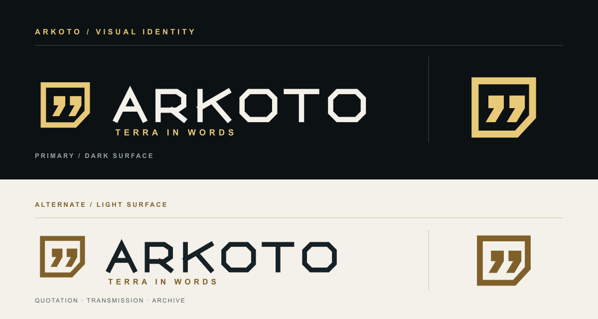

# Arkoto 视觉标识

标志由一枚带斜角出口的通讯框和两枚几何引号组成，呼应项目把泰拉台词送到网页与应用的用途。字标以直线和斜角构成，延续网站现有的档案、信号视觉语言。

## 文件

| 文件 | 用途 |
| --- | --- |
| [`public/logo-mark.svg`](../public/logo-mark.svg) | 透明背景图标，适合头像、徽章和小尺寸应用 |
| [`public/logo-mark-light.svg`](../public/logo-mark-light.svg) | 浅色背景的透明图标 |
| [`public/logo-horizontal.svg`](../public/logo-horizontal.svg) | 深色背景的横版主标志 |
| [`public/logo-horizontal-light.svg`](../public/logo-horizontal-light.svg) | 浅色背景的横版标志 |
| [`public/favicon.svg`](../public/favicon.svg) | 深色背景的网站图标 |

## 基本规范

- 深色底色 `#0c1114`，正文浅色 `#f3f1e9`，强调金色 `#e7c977`。
- 浅色版使用深色字标 `#162126` 与深金色 `#80602a`。
- 横版标志建议宽度至少 180 px；更小的场景使用独立图标。
- 图标四周建议至少保留相当于外框线宽两倍的空白。
- 标志为 Arkoto 项目自身的图形，不包含游戏官方标志或角色素材。
